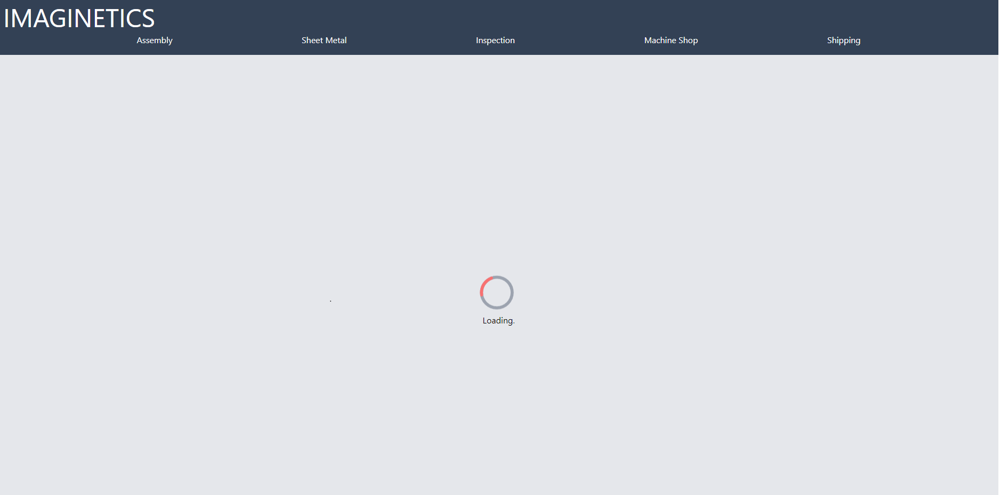
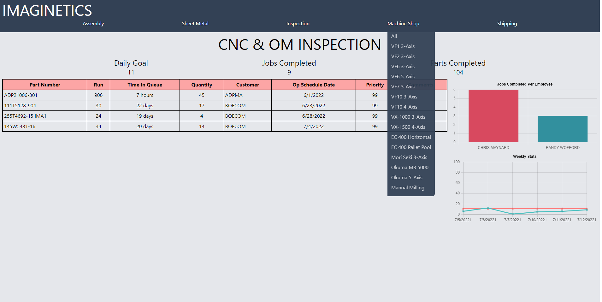
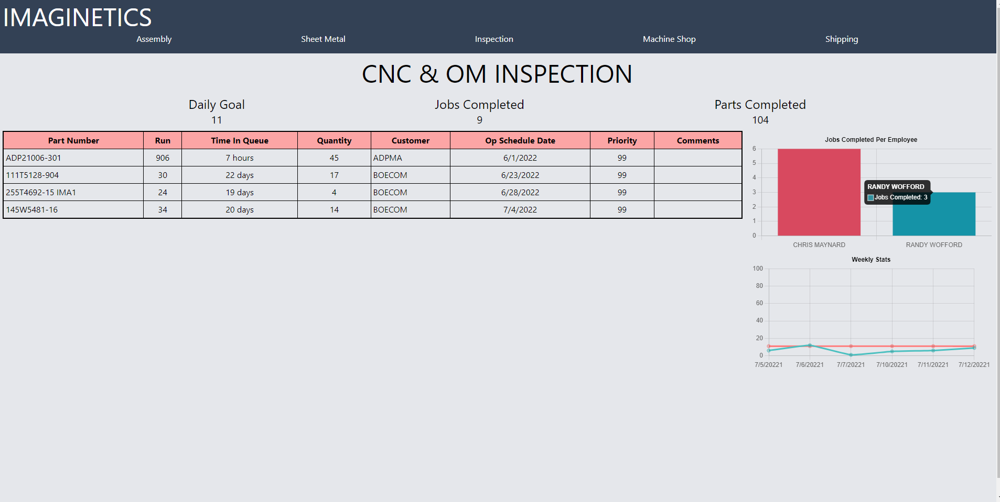
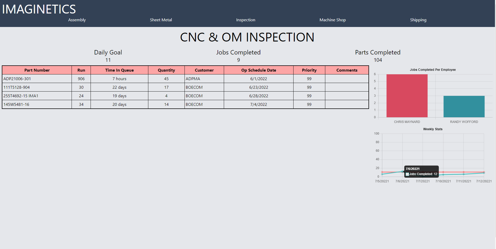

# QUEUE STATS

- FRONTEND: SvelteKit
- BACKEND: Go
- DATABASE: SQL Server

## LOADER

### Page displays a loading spinner while retrieving data from the API.
### Data gathered:
- Top 20 jobs in workcenter
- Jobs completed per day (employee)
- Jobs completed per day (work center)
- Jobs completed per week (work center)
- Parts completed per day (work center)
- Goal of job count to complete per day

---

## MENU

### Each route is created using [slug].svelte, where [slug] is the workcenter number and data is fetched from the API based on this value.
--- 

## STATS EXAMPLE 1

### Top chart displays a count of completed jobs per employee from the workcenter
---

## STATS EXAMPLE 2

### Bottom chart displays stats of jobs completed per day from the last week
---

### [Sample work center data](./src/lib/sample.js)
### [Navigation data object](./src/lib/data.js)